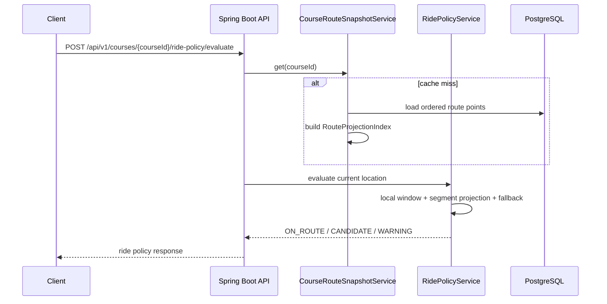
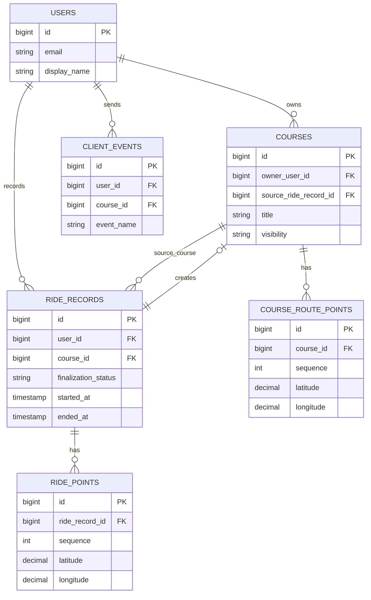

# GAJA Backend

## 1. 한 줄 요약

자전거 주행 중 경로, 날씨, 주행 상태를 한 화면에서 확인하도록 돕는 GAJA 서비스의 Spring Boot 백엔드입니다.

## 2. 내가 맡은 역할


- 코스 조회, route point 조회, 코스 공유/다운로드 API 구현
- 주행 시작 가능 여부와 경로 이탈 판단 정책 구현
- 자유 주행 기록 저장, finalization 상태 전이, 기록 기반 코스 생성 구현
- 외부 날씨 API 연동과 stale/fallback 정책 구현
- `/health`, `/health/monitor`, request id 기반 요청 추적 구성
- k6 smoke/baseline/stress 부하 검증 스크립트 작성
- AI 코스 생성에서 Gemini worker, self-host GraphHopper, 고도/도로 근거 기반 점수화 구현

## 3. 문제 정의

자전거 주행 중 사용자가 지도, 날씨, 주행 상태를 여러 앱에서 번갈아 확인하면 주행 집중도가 떨어집니다. 백엔드는 코스 경로와 현재 위치를 기준으로 주행 가능 여부와 이탈 상태를 판단하고, 외부 날씨 API가 느리거나 실패해도 앱 응답이 흔들리지 않도록 보호해야 했습니다.

AI 코스 생성에서는 "평지 위주", "오르막 많은 코스", "강이 보이는 코스" 같은 자연어 요청을 실제 자전거 도로망과 고도 근거로 검증해야 했습니다. 단순히 AI가 좌표를 만드는 방식은 도로망, 고도, 노면, 자전거도로 근거가 약했기 때문에 백엔드가 GraphHopper 경로를 source of truth로 삼고 AI 설명은 후보/서술 역할로 분리했습니다.

## 4. 핵심 기능

- 추천/전체 코스, 코스 상세, 경로 좌표 조회
- local window + segment projection 기반 최근접 경로 계산
- 경로 이탈 후보/경고/복귀 상태 판단
- route snapshot cache로 route-points/download/ride-policy hot path 재사용
- 자유 주행 기록 저장과 `FINALIZING -> READY/FAILED` 상태 전이
- Open-Meteo current weather + hourly fallback + stale cache fallback
- Gemini AI worker 텍스트 의도 해석 + self-host GraphHopper 경로 후보
- elevation summary와 도로 근거 기반 추천 점수
- `/health`, `/health/monitor`, Prometheus/Grafana 관측 지점
- k6 시나리오 기반 API 부하 검증

## 5. 핵심 코드 바로가기

| 보여줄 코드 | 링크 | 이유 |
| --- | --- | --- |
| 주행 상태 전이 | [`RideRecordEntity.markFinalizing/markReady/markFailed`](https://github.com/BIKE-PROJECT-MINJI/bike-back/blob/main/src/main/java/com/bikeprojectminji/bikeback/ride/entity/RideRecordEntity.java#L116-L138) | 주행 종료 후 저장 상태를 명확히 분리한 도메인 판단입니다. |
| 주행 기록 finalization | [`RideRecordFinalizationService.finalizeRideRecord`](https://github.com/BIKE-PROJECT-MINJI/bike-back/blob/main/src/main/java/com/bikeprojectminji/bikeback/ride/service/RideRecordFinalizationService.java#L72-L100) | raw point를 처리해 기록을 확정하고 실패 상태를 남깁니다. |
| 경로 이탈 판단 | [`RidePolicyService.evaluateOffRoute`](https://github.com/BIKE-PROJECT-MINJI/bike-back/blob/main/src/main/java/com/bikeprojectminji/bikeback/ride/policy/service/RidePolicyService.java#L203-L279) | `ON_ROUTE -> CANDIDATE -> WARNING` 판단과 복귀 처리를 확인할 수 있습니다. |
| 경로 투영 | [`RouteProjectionIndex`](https://github.com/BIKE-PROJECT-MINJI/bike-back/blob/main/src/main/java/com/bikeprojectminji/bikeback/ride/policy/service/RouteProjectionIndex.java#L20-L38) | 단순 point 비교가 아니라 segment projection 기준으로 최근접 지점을 찾습니다. |
| route snapshot | [`CourseRouteSnapshotService`](https://github.com/BIKE-PROJECT-MINJI/bike-back/blob/main/src/main/java/com/bikeprojectminji/bikeback/course/service/CourseRouteSnapshotService.java#L40-L94) | ordered route list와 projection index를 snapshot으로 재사용합니다. |
| 외부 날씨 fallback | [`OpenMeteoWeatherProvider`](https://github.com/BIKE-PROJECT-MINJI/bike-back/blob/main/src/main/java/com/bikeprojectminji/bikeback/weather/infrastructure/OpenMeteoWeatherProvider.java#L56-L171) | current payload 실패 시 hourly forecast snapshot으로 fallback합니다. |
| stale weather fallback | [`WeatherService.getCurrent`](https://github.com/BIKE-PROJECT-MINJI/bike-back/blob/main/src/main/java/com/bikeprojectminji/bikeback/weather/service/WeatherService.java#L63-L124) | 외부 지연과 사용자 응답을 분리하는 stale-first 보호 전략입니다. |
| AI 경로 응답 조립 | [`AiRoutePlanComposer`](https://github.com/BIKE-PROJECT-MINJI/bike-back/blob/main/src/main/java/com/bikeprojectminji/bikeback/airoute/service/AiRoutePlanComposer.java) | AI 설명 후보와 GraphHopper 경로 후보를 API 응답으로 조립합니다. |
| 고도/도로 점수화 | [`RecommendationScoreCalculator`](https://github.com/BIKE-PROJECT-MINJI/bike-back/blob/main/src/main/java/com/bikeprojectminji/bikeback/airoute/service/RecommendationScoreCalculator.java) | 평지/업힐/자전거도로 선호를 점수로 분리합니다. |
| GraphHopper adapter | [`GraphHopperBicycleRoutingClient`](https://github.com/BIKE-PROJECT-MINJI/bike-back/blob/main/src/main/java/com/bikeprojectminji/bikeback/routing/infrastructure/GraphHopperBicycleRoutingClient.java) | self-host GraphHopper 응답을 백엔드 routing DTO로 변환합니다. |
| AI route ADR | [`docs/adr-ai-route-graphhopper-elevation.md`](docs/adr-ai-route-graphhopper-elevation.md) | 구현 이유, 선택지, tradeoff, 문제 해결 과정을 기록했습니다. |
| `/health` | [`HealthController`](https://github.com/BIKE-PROJECT-MINJI/bike-back/blob/main/src/main/java/com/bikeprojectminji/bikeback/global/health/HealthController.java#L8-L20) | public smoke check 기준입니다. |
| `/health/monitor` | [`MonitoringController`](https://github.com/BIKE-PROJECT-MINJI/bike-back/blob/main/src/main/java/com/bikeprojectminji/bikeback/global/monitor/MonitoringController.java#L7-L19) | DB/Redis 상태를 포함한 운영 확인 경로입니다. |
| request id 추적 | [`HttpRequestLoggingFilter`](https://github.com/BIKE-PROJECT-MINJI/bike-back/blob/main/src/main/java/com/bikeprojectminji/bikeback/global/logging/HttpRequestLoggingFilter.java#L14-L44) | `X-Request-Id`를 MDC와 응답 헤더에 연결합니다. |
| k6 부하 테스트 | [`ops/loadtest/k6/bike-api.js`](https://github.com/BIKE-PROJECT-MINJI/bike-back/blob/main/ops/loadtest/k6/bike-api.js#L83-L169) | persona 기반 시나리오와 p95/error-rate threshold가 있습니다. |

## 6. 아키텍처

```mermaid
flowchart LR
    Client[Mobile / Frontend] --> API[Spring Boot API]
    API --> Auth[Auth / Profile]
    API --> Course[Course Domain]
    API --> Ride[Ride Domain]
    API --> Weather[Weather Domain]
    API --> Event[Client Event Domain]

    Course --> Snapshot[CourseRouteSnapshotService]
    Snapshot --> Projection[RouteProjectionIndex]
    Ride --> Policy[RidePolicyService]
    Policy --> Projection
    Ride --> Finalize[RideRecordFinalizationService]
    Weather --> Provider[OpenMeteoWeatherProvider]
    Weather --> Cache[Last Success Weather Cache]

    API --> Postgres[(PostgreSQL / PostGIS)]
    API --> Redis[(Redis)]
    Provider --> OpenMeteo[Open-Meteo API]
    API --> Health[/health]
    API --> Monitor[/health/monitor]
```



## 7. ERD



## 8. API 명세

| Domain | Endpoints |
| --- | --- |
| Auth/Profile | `POST /api/v1/auth/register`, `POST /api/v1/auth/login`, `POST /api/v1/auth/refresh`, `GET /api/v1/auth/me`, `GET/PATCH /api/v1/profile/me` |
| Course | `GET /api/v1/courses`, `GET /api/v1/courses/featured`, `GET /api/v1/courses/{courseId}`, `GET /api/v1/courses/{courseId}/route-points` |
| Course Write/Share | `POST /api/v1/courses`, `PUT /api/v1/courses/{courseId}`, `PATCH /api/v1/courses/{courseId}/visibility`, `POST /api/v1/courses/{courseId}/share`, `GET /api/v1/courses/search`, `GET /api/v1/courses/{courseId}/download` |
| Ride | `POST /api/v1/courses/{courseId}/ride-policy/evaluate`, `POST /api/v1/ride-records`, `GET /api/v1/ride-records/{rideRecordId}`, `POST /api/v1/ride-records/{rideRecordId}/regenerate` |
| Event | `POST /api/v1/events`, `POST /api/v1/events/batch` |
| Weather/Ops | `GET /api/v1/weather/current`, `GET /health`, `GET /health/monitor` |

## 9. 실행 방법

### 9-1. 로컬 PostGIS/Redis 실행

`docker-compose.local.yml`은 로컬 개발용 PostGIS와 Redis를 호스트 포트 `5433`, `6380`에 노출합니다.
`.env.example`도 이 포트 기준으로 맞춰져 있으므로 그대로 복사해 실행할 수 있습니다.

```bash
cp .env.example .env
docker compose -f docker-compose.local.yml up -d postgres redis
set -a && source .env && set +a
./gradlew bootRun
```

### 9-2. Ngrok + Expo Go smoke

휴대폰의 Expo Go에서 로컬 백엔드를 호출해야 할 때는 Spring Boot를 `PORT=8080`으로 실행한 뒤 별도 터미널에서 Ngrok HTTP 터널을 엽니다.
Ngrok은 검증된 계정의 authtoken이 필요하므로 `.env`에 `NGROK_AUTHTOKEN`을 채운 뒤 실행합니다.

```bash
set -a && source .env && set +a
npx --yes ngrok http 8080 --authtoken "$NGROK_AUTHTOKEN"
```

Ngrok이 발급한 `https://...ngrok...` 주소는 RN 프로젝트의 `EXPO_PUBLIC_API_BASE_URL`에 넣습니다.

```bash
cd ../bike-rn
printf 'EXPO_PUBLIC_API_BASE_URL=https://example.ngrok.app\n' > .env.local
npx expo start
```

터널 연결 확인은 아래 순서로 봅니다.

```bash
curl -i https://example.ngrok.app/health
curl -i https://example.ngrok.app/health/monitor
curl -i -X POST https://example.ngrok.app/api/v1/auth/register \
  -H 'Content-Type: application/json' \
  -d '{"email":"smoke@example.com","password":"Password123!","displayName":"Smoke"}'
```

상세 절차는 [`RN_Expo_Go_Ngrok_백엔드_스모크_런북.md`](../../DOCS/15_기능명세/backend/RN_Expo_Go_Ngrok_백엔드_스모크_런북.md)를 기준으로 합니다.

## 10. 테스트/검증

```bash
./gradlew --no-daemon clean check build
```

```bash
cp ops/loadtest/k6.env.example ops/loadtest/k6.env
k6 run ops/loadtest/k6/bike-api.js
```

- 대표 로컬 k6 결과 후보에서 route-read p95 약 `15.7ms`, health p95 약 `271.7ms`를 확인했습니다.
- raw 결과 디렉터리는 기본적으로 git에 올리지 않고, README에는 실패한 단일 요청 결과를 성능 근거로 쓰지 않습니다.

## 11. 트러블슈팅

| 문제 | 원인 | 해결 | 배운 점 |
| --- | --- | --- | --- |
| 경로 이탈 판단 흔들림 | 단일 point 거리 비교 한계 | segment projection + local window + full-scan fallback | 위치 기반 로직은 correctness 기준을 먼저 고정해야 함 |
| route-points 반복 조회 비용 | 여러 API가 같은 route ordered list 반복 로드 | snapshot cache와 projection index 재사용 | source of truth와 read hot path 최적화를 분리할 수 있음 |
| 외부 날씨 API 지연/실패 | provider 응답 지연 또는 payload 누락 | hourly fallback, stale cache, timeout grace window | 외부 API 장애와 사용자 응답 장애를 분리해야 함 |
| CD 실패 | SSM 대상 EC2가 valid managed instance 상태가 아님 | EC2 running, SSM Agent, instance profile, `APP_INSTANCE_ID` 확인 | 코드 실패와 인프라 설정 실패를 분리해야 함 |

## 12. 한계와 개선점

- route snapshot은 현재 in-process cache라 다중 인스턴스 운영에서는 shared cache 승격을 검토해야 합니다.
- 경로 이탈 threshold는 실제 주행 데이터가 쌓이면 보정이 필요합니다.
- Swagger/OpenAPI 정적 문서는 아직 없습니다. 현재는 controller/DTO와 README 표를 기준으로 API를 확인합니다.
- k6 raw result는 로컬 보관이며, 포트폴리오에는 선별 요약만 남깁니다.
