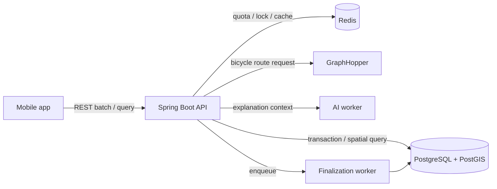
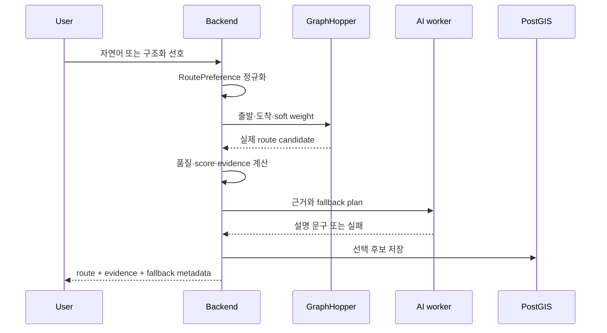

# GAJA Backend


GAJA는 자전거 코스 추천, 코스 따라가기, 자유주행 기록을 제공하는 백엔드입니다. 이 저장소는 기능 목록보다 **모바일 재시도에서 기록이 중복되지 않는지**, **GPS 오차와 실제 이탈을 구분하는지**, **AI 설명이 실제 경로 근거를 덮지 않는지**를 재현 가능한 테스트로 보여주는 데 초점을 둡니다.

제가 맡은 범위는 Spring Boot API, PostgreSQL/PostGIS 저장 계약, GraphHopper 경로 조합, 주행 정책 계산, 비동기 finalization, provider fallback과 운영 관측성입니다.

## 30초 검증

| 검증 | 확인한 결과 | 공개 evidence |
|---|---|---|
| 실제 PostGIS 계약 | 빈 DB에 운영 Flyway **35개** 적용, SRID 4326 geometry와 GiST 생성, `ST_MakeLine` 점 순서 확인 | [postgis-contract.json](ops/smoke/public-evidence/postgis-contract.json) |
| 모바일 중복 저장 | Redis 잠금 장애에서도 동일 `clientRideId` **동시 10요청 -> record 1건**과 finalization job 1건으로 수렴 | [postgres-application-contract.json](ops/smoke/public-evidence/postgres-application-contract.json) |
| 경로 판단 | 고정 trace로 49/51m, 15초, 복귀, 위치 품질, 비순환·순환 완주 **9/9** 재현 | [route-policy-replay.json](ops/smoke/public-evidence/route-policy-replay.json) |
| 근거 기반 AI 코스 | 자연어 정규화, soft weight, provider 실패, evidence 부족, quota를 deterministic golden set으로 확인 | [ai-route-golden-set.json](ops/smoke/public-evidence/ai-route-golden-set.json) |

전체 evidence 재생성:

```bash
./ops/smoke/generate-public-evidence.sh
```

이 명령은 H2 기반 빠른 계약 테스트와 Docker 기반 PostGIS 테스트를 분리 실행한 뒤, 공개 JSON에서 token·key·DB 자격증명 패턴을 검사합니다.

## 책임 경계



- 앱은 GPS 원본을 로컬에 보존하고 완료 시 REST batch로 전송합니다.
- PostgreSQL unique constraint가 `clientRideId` 최종 멱등성 경계이며 Redis lock은 경합을 줄이는 보조 장치입니다.
- GraphHopper가 경로 좌표를 만들고 백엔드가 score/evidence를 계산합니다.
- AI worker는 summary와 explanation만 보강하며 좌표, 점수, evidence, routing metadata를 덮을 수 없습니다.

## AI 코스 흐름



현재 자연어 resolver는 평지·강변·업힐 같은 제한된 의도를 처리합니다. 목표 거리, 비포장 회피 등 아직 정규화하지 않는 표현은 golden evidence에 `unsupported`로 남기며 구현된 것처럼 소개하지 않습니다. GraphHopper가 경로를 반환했다는 사실도 사용자 만족도나 좋은 코스의 증거로 간주하지 않습니다.

## 핵심 동작

### 자유주행 저장

1. 앱이 `clientRideId`와 GPS trace를 batch 전송합니다.
2. API가 입력을 검증하고 record와 raw point를 한 transaction에 저장합니다.
3. 중복 요청은 Redis lock 또는 PostgreSQL unique constraint 이후 기존 ID로 수렴합니다.
4. commit 후 finalization job을 만들고 `FINALIZING`을 반환합니다.
5. worker가 보정을 마치면 `READY`, 재시도 한계를 넘으면 `FAILED`가 됩니다.

### 코스 따라가기

전체 route polyline에 현재 위치를 정사영해 경로 이탈 거리와 진행률을 계산합니다. 이탈은 `ON_ROUTE -> CANDIDATE -> WARNING`으로 누적하고 복귀 기준을 별도로 둡니다. 완주는 단순 종점 도달이 아니라 coverage, 종점 거리, 순환 코스의 시작 구역 이탈·복귀를 함께 봅니다.

### GPX와 권한

GPX는 허용 크기, track point 수, XML 형식, 좌표 범위를 검증한 뒤 course와 route geometry를 한 transaction에 저장합니다. PRIVATE 코스와 주행 기록은 소유권 검사를 통과한 사용자만 조회·수정·삭제할 수 있습니다.

## 실행

요구 사항: JDK 17, Docker.

```bash
git clone https://github.com/BIKE-PROJECT-MINJI/bike-back.git
cd bike-back

./gradlew clean check
./gradlew postgisTest
```

기본 `test`는 빠른 H2 suite를 유지하고, `postgisTest`만 고정된 `postgis/postgis:16-3.4` 컨테이너에서 운영 Flyway와 실제 공간 타입을 검증합니다. 실제 provider smoke는 secret이 있는 승인 환경에서만 별도로 실행합니다.

로컬 서버와 health check:

```bash
./gradlew bootRun
curl -fsS http://127.0.0.1:8080/health
```

대표 API:

| 흐름 | API |
|---|---|
| 코스 | `GET /api/v1/courses`, `GET /api/v1/courses/{id}/route-points` |
| 따라가기 | `POST /api/v1/courses/{id}/ride-policy/evaluate` |
| 자유주행 | `POST /api/v1/ride-records`, `POST /api/v1/ride-records/{id}/trace` |
| AI 코스 | `POST /api/v1/ai-routes/plan`, `POST /api/v1/ai-routes/plan/from-text` |
| GPX | `POST /api/v1/courses/import-gpx` |

Swagger UI는 서버 실행 후 `http://127.0.0.1:8080/swagger-ui.html`에서 확인할 수 있습니다. CI는 전체 OpenAPI JSON snapshot 대신 대표 path와 핵심 schema field를 검사합니다.

## 검증 범위와 한계

이번 공개 evidence가 증명하는 범위:

- 고정 PostGIS 이미지의 빈 DB에서 현재 migration 전체 적용
- synthetic fixture에서 공간 컬럼·인덱스·경로 geometry 계약
- 실제 PostgreSQL 경합에서 주행 저장 중복 수렴
- synthetic trace 경계의 상태 전이 일관성
- deterministic fake provider에서 AI 책임 경계와 fallback metadata

아직 증명하지 않은 범위:

- 실기기 장거리 주행의 GPS 오탐률과 사용자 만족도
- 실시간 외부 provider의 코스 품질·재고·가용성
- 공개 evidence commit 이전에 적용된 DB의 V16 checksum 호환성
- 이 작은 fixture에서 GiST가 실제 성능을 개선했다는 주장
- synthetic replay latency를 운영 p95/p99로 일반화하는 주장

운영 Flyway 이력은 불변이어야 합니다. 현재 V16 checksum 이력은 별도 차단 이슈로 추적하며, 복구 승인과 기존 schema history 검증 전에는 “기존 DB 업그레이드 안전”을 주장하지 않습니다.

## 저장소 구조

```text
src/main/java/com/bikeprojectminji/bikeback/
  auth/       인증과 token rotation
  course/     코스, GPX, route snapshot
  ride/       주행 기록, 정책, finalization
  airoute/    선호 정규화, 경로 조합, AI 설명
  routing/    GraphHopper provider와 품질 계약
  global/     응답, 예외, metric, request id

ops/smoke/
  generate-public-evidence.sh
  check-public-evidence.sh
  public-evidence/
```

관련 저장소: [BIKE-PROJECT-MINJI/bike-ai-route](https://github.com/BIKE-PROJECT-MINJI/bike-ai-route)
