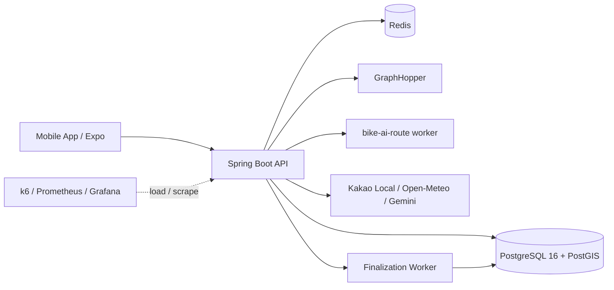

# BIKE Backend


BIKE/GAJA는 위치 기록, 코스 조회, 주행 상태 판단, 외부 provider 연동을 다루는 Spring Boot 백엔드입니다.
이 README는 채용 검토자가 5분 안에 "무엇을 구현했고, 어디를 보면 되는지" 확인할 수 있도록 정리했습니다.

## For Reviewers: 5-Minute Route

### 1. 이 프로젝트에서 확인할 수 있는 백엔드 기본기

| 확인할 역량 | 이 저장소에서 보는 위치 |
|---|---|
| 등록/조회/상태 변경 API | `CourseController`, `RideRecordController`, `AiRouteGenerationSessionController` |
| 권한과 인증 | `SecurityConfig`, `AuthController`, `CourseAccessPolicyTest`, `AdminEndpointSecurityTest` |
| 검색/페이징/조회 최적화 | `CourseRepositoryImpl`, `CourseQueryServiceTest`, `CourseRouteSnapshotServiceTest` |
| 트랜잭션과 데이터 정합성 | `CourseService`, `RideRecordService`, `IdempotencyLockService`, `RideSaveConcurrencyGateTest` |
| 외부 API 실패 기준 | `AddressSearchService`, `WeatherService`, `AiRoutePlannerService` |
| 운영 전 검증 | `ops/loadtest/results/*readable-report.md`, `ops/smoke/` |

### 2. 대표 기능 4개

1. **위치 기록 저장**: GPS trace를 저장하고 `FINALIZING -> READY/FAILED` 상태로 후처리합니다.
2. **중복 저장 방지**: `clientRideId`, Redis lock, DB unique 기준으로 재시도 요청을 한 결과로 수렴시킵니다.
3. **외부 연동 실패 대응**: 주소, 날씨, AI worker, GraphHopper 실패를 기능별 fallback/stale/unavailable 상태로 분리합니다.
4. **부하와 병목 검증**: k6, request id/trace id, Hikari, provider latency, finalization backlog를 함께 보고 병목 후보를 좁혔습니다.

### 3. 빠른 확인 명령

전체 테스트가 아니라, 이력서/포트폴리오에 직접 연결되는 대표 테스트만 빠르게 확인하는 명령입니다.

```bash
./gradlew test \
  --tests "com.bikeprojectminji.bikeback.global.database.DatabaseBackpressureFilterTest" \
  --tests "com.bikeprojectminji.bikeback.global.idempotency.IdempotencyLockServiceTest" \
  --tests "com.bikeprojectminji.bikeback.ride.service.RideSaveConcurrencyGateTest" \
  --tests "com.bikeprojectminji.bikeback.ride.policy.service.RidePolicyServiceTest" \
  --tests "com.bikeprojectminji.bikeback.course.repository.CourseRepositoryImplTest" \
  --tests "com.bikeprojectminji.bikeback.airoute.session.AiRouteGenerationSessionServiceIntegrationTest" \
  --no-daemon
```

최근 로컬 확인 결과: 위 대표 테스트 41개 통과, `BUILD SUCCESSFUL`.

### 4. 대표 k6 evidence

아래 수치는 운영 보증이 아니라, 개발 단계에서 병목을 찾기 위한 short evidence입니다.

| 검증 | 결과 | 파일 |
|---|---|---|
| Smoke/contract | 실패율 0%, checks 100%, p95 약 79ms | `ops/loadtest/results/aws-approved-smoke-contract-20260628-0606-readable-report.md` |
| 25VU baseline | 실패율 0%, checks 100%, p95 약 44ms | `ops/loadtest/results/aws-approved-baseline-25vu-20260628-0608-readable-report.md` |
| Course follow/HUD 50VU | 실패율 0%, checks 100%, p95 약 41ms | `ops/loadtest/results/aws-course-follow-readhud-50vu-20260628-0423-readable-report.md` |
| Ride finalization 50VU | 실패율 약 0.06%, checks 약 99.88%, p95 약 83.9ms | `ops/loadtest/results/aws-ride-gate-finalization-50vu-20260628-0518-readable-report.md` |
| AI 포함 50VU 보정 후 | HTTP 실패율 0%, p95 약 39ms | `ops/loadtest/results/aws-approved-mixed-ai-50vu-20260628-0609-readable-report.md` |

### 5. 범위와 한계

- 이 프로젝트는 실제 장기 운영 서비스가 아니라, 운영 전 리스크를 개발 단계에서 검증한 개인 프로젝트입니다.
- AI 코스 생성은 추천 품질을 사용자 데이터로 검증한 단계가 아닙니다. 핵심은 AI가 만든 결과를 그대로 믿지 않고, 서버 기준으로 저장 가능 여부와 evidence를 나눈 점입니다.
- ALB 다중 인스턴스, 장기 Grafana evidence, 실제 provider 고부하 검증은 후속 과제입니다.

## 30-Second Story

이 저장소의 핵심은 "위치 기반 서비스를 만들었다"가 아니라 **사용자가 저장, 조회, 외부 연동 실패를 겪는 순간 백엔드가 어떤 상태와 응답을 보장할지 정한 것**입니다.

자전거 주행 중에는 코스 조회, 주행 상태 판단, 날씨, 주소검색, 기록 저장이 동시에 섞입니다. 이때 느린 provider 하나나 저장 요청 폭주 하나가 전체 화면을 흔들지 않도록 API 응답 기준, DB 상태 모델, 중복 요청 방지, 후처리 job, fallback metadata를 나눴습니다.

## At a Glance

| 사용자 흐름 | 백엔드가 책임지는 것 | 운영 관점 |
|---|---|---|
| AI 코스 추천 | 자연어를 `RoutePreference`로 정규화하고 GraphHopper/GIS evidence로 후보를 평가 | provider 실패와 품질 근거 부족을 fallback metadata로 노출 |
| 코스따라가기 | route polyline projection으로 진행률, 이탈, 잔여거리, 완주 가능성 계산 | read/HUD 부하를 저장/AI 부하와 분리해 p95/p99 측정 |
| 자유주행 저장 | 모바일 GPS trace를 batch 저장하고 finalization worker가 보정 | 저장 폭주 시 `RIDE_SAVE_BUSY`와 비동기 `FINALIZING -> READY` UX로 보호 |
| Party 위치 공유 | socket token과 Party 권한을 기준으로 위치 공유 | Redis token/cache 장애와 다중 인스턴스 한계를 별도 검증 대상으로 분리 |

## Quick Links

- [For Reviewers: 5-Minute Route](#for-reviewers-5-minute-route)
- [30-Second Story](#30-second-story)
- [Architecture](#architecture)
- [Core Features](#core-features)
- [Problem-Solving Notes](#problem-solving-notes)
- [API Groups](#api-groups)
- [Operational Testing Evidence](#operational-testing-evidence)
- [What This Does Not Prove Yet](#what-this-does-not-prove-yet)
- [Getting Started](#getting-started)

## Highlights

| 영역 | 구현 포인트 |
|---|---|
| AI 코스 생성 | LLM이 좌표를 찍는 구조가 아니라, 자연어를 `RoutePreference`로 정규화하고 GraphHopper custom weighting/GIS evidence/백엔드 scorer로 후보를 평가합니다. |
| 코스따라가기 HUD | route point 하나와 현재 위치를 단순 비교하지 않고, route polyline projection으로 진행률, 이탈 거리, 잔여 거리, 완주 가능성을 계산합니다. |
| 자유주행 저장 | 모바일에서 모은 GPS trace를 REST batch로 저장하고, finalization worker가 smoothing/후처리를 수행합니다. 저장 직후에는 `FINALIZING`, 완료 후 `READY`로 전환합니다. |
| 운영 보호 | DB connection 고갈, provider timeout, Redis 장애, GraphHopper 지연 같은 상황을 빠른 429/503, fallback metadata, stale cache, retryable response로 분리합니다. |
| 관측성 | request id/trace id, endpoint p95/p99, 내부 operation duration, Hikari metric, Redis metric, provider latency/failure, finalization backlog를 함께 봅니다. |
| 검증 방식 | local smoke에서 AWS short evidence gate까지 단계화하고, 비용이 생기는 검증은 TTL/삭제 기준을 둡니다. |

## Architecture



### Runtime Roles

| Role | 책임 |
|---|---|
| API | 인증, 코스, 주행 기록, 주소검색, 날씨, AI route session, Party API를 처리합니다. |
| Worker | 자유주행 기록 finalization, smoothing, 재처리, job 상태 전이를 담당합니다. |
| Redis | quota/rate-limit, socket token, idempotency lock, weather/route cache를 담당합니다. |
| GraphHopper | 실제 자전거 경로 탐색과 route detail evidence를 제공합니다. |
| AI worker | 자연어 의도 정규화, 후보 설명, trade-off 문구 생성을 담당합니다. |

## Core Features

### 1. AI Route Recommendation

```text
사용자 입력
  -> RoutePreference 정규화
  -> GraphHopper profile/custom weighting 적용
  -> GIS evidence 기반 score 계산
  -> AI worker 설명 생성
  -> 후보 저장/따라가기 연결
```

주요 기준:

- GraphHopper 호출 수는 quota, timeout, provider capacity 기준으로 제한하고, 후보 비교가 필요할 때도 비용과 지연 시간을 먼저 봅니다.
- 안전/통행 가능성은 hard filter, 평지/자전거도로/강변/노면 선호는 soft weight로 처리합니다.
- scenery, riverside, park 같은 근거가 부족하면 성공처럼 숨기지 않고 `PARTIAL` 또는 `UNKNOWN` metadata로 내려줍니다.
- AI worker가 실패해도 좌표와 route point 정합성은 백엔드/GraphHopper evidence를 기준으로 유지합니다.

### 2. Course Follow HUD

코스따라가기는 단순히 "현재 위치가 route point와 가까운가"를 보지 않습니다.

- route points를 polyline segment로 변환합니다.
- 현재 위치를 가장 가까운 선분에 정사영합니다.
- `nearestSegmentIndex`, `distanceAlongRouteM`, `remainingDistanceM`, `progressPercent`를 계산합니다.
- GPS 튐을 흡수하기 위해 `ON_ROUTE -> CANDIDATE -> WARNING -> ON_ROUTE` 상태 전이를 둡니다.
- 완주는 종점 근접만 보지 않고 coverage 기반으로 판단합니다.

### 3. Ride Record Finalization

자유주행 저장은 사용자 응답 경로와 후처리를 분리합니다.

- 모바일 앱은 GPS trace를 로컬에 보존합니다.
- 서버는 `clientRideId` 기준으로 중복 저장을 막습니다.
- 저장 성공 후 finalization job을 만들고 `FINALIZING` 상태를 반환할 수 있습니다.
- worker가 trace smoothing과 보정 작업을 끝내면 `READY`가 됩니다.
- 저장 요청이 몰리면 오래 버티다 실패하지 않고 `RIDE_SAVE_BUSY`와 `Retry-After`로 빠르게 보호합니다.

### 4. Weather / Address / Provider Fallback

외부 API는 핵심 사용자 흐름을 막지 않도록 기능별로 다르게 처리합니다.

| 기능 | 우선 provider | fallback / 보호 정책 |
|---|---|---|
| 주소검색 | Kakao Local | Nominatim fallback, fallback metadata 제공 |
| 날씨 | Open-Meteo | 구역 단위 Redis cache, stale fallback, cold miss soft-degrade |
| AI 설명 | Gemini / AI worker | backend fallback explanation, provider failure metadata |
| Routing | self-host GraphHopper | 운영 응답은 실패/부분 metadata로 보호하고, smoke/load에서는 fake/hosted profile을 분리 검증 |

## Problem-Solving Notes

이 섹션은 포트폴리오나 면접에서 설명할 때의 핵심 문제 해결 흐름입니다.

### 1. 50VU 혼합 부하에서 DB connection 병목을 분리

초기 50VU 혼합 부하에서는 AI route, 주행 저장, read/HUD 요청이 함께 들어왔고, HTTP 실패율과 p95가 동시에 나빠졌습니다. 로그와 metric을 같이 보니 GraphHopper 평균 latency보다 Hikari active/waiting 상태와 DB connection timeout이 먼저 튀었습니다.

대응은 단순히 connection pool을 크게 키우는 쪽으로 가지 않았습니다.

- 반복 회원가입/토큰 발급 write 부하는 테스트 token pool로 분리했습니다.
- provider 호출과 DB 저장 transaction 경계를 분리했습니다.
- 주행 저장 폭주는 `RIDE_SAVE_BUSY`와 `Retry-After`로 빠르게 돌려보내 read/HUD 요청을 보호했습니다.
- finalization은 동기 완료를 강제하지 않고 `FINALIZING -> READY` 상태 모델로 분리했습니다.

이후 AI 포함 50VU 보정 테스트에서 HTTP 실패율 0%, p95 약 39ms, p99 약 108ms 수준까지 회복한 evidence를 남겼습니다.

### 2. 코스따라가기 HUD를 단순 거리 비교에서 projection 판정으로 변경

코스따라가기는 현재 위치와 가까운 route point 하나를 비교하면 GPS 튐, 코너, 긴 segment에서 오판이 생깁니다. 그래서 route points를 polyline segment로 보고 현재 위치를 가장 가까운 선분에 정사영합니다.

서버는 `nearestSegmentIndex`, `distanceAlongRouteM`, `remainingDistanceM`, `progressPercent`, 이탈 상태를 계산합니다. 이전 segment hint가 틀리면 full-scan fallback으로 올바른 선분을 다시 찾도록 설계했습니다.

이 구조 덕분에 프론트가 임의로 경로 진행률을 계산하지 않고, 서버의 단일 정책으로 시작 가능/이탈/복귀/완주 후보 상태를 판단할 수 있습니다.

### 3. AI 코스 생성에서 LLM 책임을 제한

AI가 직접 좌표를 만들게 하면 그럴듯한 설명은 나와도 실제 주행 가능한 route point 정합성이 깨질 수 있습니다. GAJA에서는 LLM을 "경로 생성자"가 아니라 "의도 정규화와 설명 보조자"로 제한했습니다.

- 자연어는 `RoutePreference`로 정규화합니다.
- 실제 경로는 GraphHopper profile/custom weighting과 백엔드 scorer가 만듭니다.
- GraphHopper route detail은 경사, 고도, 노면, 자전거도로, 도로 유형 evidence의 기준입니다.
- 수변/공원/풍경 근거가 부족하면 `UNKNOWN` 또는 `PARTIAL` metadata로 표시합니다.
- AI worker 실패는 backend fallback explanation으로 격리합니다.

### 4. 외부 의존성을 기능별 fallback으로 나눔

모든 실패를 재시도로 처리하면 사용자는 기다림만 느끼고, provider 비용과 queue가 같이 커집니다. 그래서 기능별로 실패 UX를 다르게 뒀습니다.

| 기능 | 사용자에게 중요한 것 | 서버 정책 |
|---|---|---|
| HUD/코스따라가기 | 주행 흐름이 멈추지 않는 것 | 날씨 같은 보조 정보는 stale/unavailable로 분리 |
| 주소검색 | 후보를 빠르게 확인하는 것 | Kakao Local 실패 시 fallback metadata와 대체 provider 결과 |
| AI 코스 | 후보 품질과 근거를 아는 것 | partial/fallback metadata를 숨기지 않음 |
| 주행 저장 | 기록이 중복/유실되지 않는 것 | `clientRideId`, Redis lock, DB unique constraint, finalization job |
| Party socket | 권한과 토큰 재사용 방지 | one-time socket token과 Redis 기반 제한 |

## API Groups

| Group | 대표 API |
|---|---|
| Health/Ops | `GET /health`, `GET /health/monitor` |
| Auth | `POST /api/v1/auth/register`, `POST /api/v1/auth/login`, `POST /api/v1/auth/refresh`, `POST /api/v1/auth/logout`, `GET /api/v1/auth/me` |
| Course | `GET /api/v1/courses`, `GET /api/v1/courses/{id}`, `GET /api/v1/courses/{id}/route-points` |
| Follow | `POST /api/v1/courses/{id}/ride-policy/evaluate` |
| Ride Record | `POST /api/v1/ride-records`, `POST /api/v1/ride-records/{id}/trace`, `POST /api/v1/ride-records/{id}/regenerate`, `DELETE /api/v1/ride-records/{id}` |
| AI Route | `POST /api/v1/ai-routes/plan`, `POST /api/v1/ai-routes/plan/from-text`, AI route session/candidate APIs |
| Address | `GET /api/v1/addresses/search` |
| Weather | `GET /api/v1/weather/current` |
| Party | Party REST APIs, socket token, `WS /ws/v1/parties/{id}/locations` |
| Events | client event single/batch 수집 |

## Tech Stack

| Layer | Stack |
|---|---|
| Language | Java 17 |
| Framework | Spring Boot 3.5.x |
| Build | Gradle |
| Database | PostgreSQL 16, PostGIS, Flyway |
| Cache / Lock | Redis |
| Routing | GraphHopper self-host |
| AI | `bike-ai-route` worker, Gemini provider, backend fallback |
| Testing | JUnit, Spring Boot Test, Python smoke scripts, k6 |
| Observability | Actuator, Prometheus metrics, Grafana, request id / trace id |
| Infra | Docker Compose local, managed dev infra 후보, AWS short evidence gate |

## Operational Testing Evidence

운영 검증은 "몇 명까지 버틴다"보다 **어떤 병목을 어떤 근거로 찾았는가**에 집중했습니다.
아래 수치는 출시 보증이 아니라, short AWS/k6 실행에서 병목을 찾고 개선 방향을 정한 evidence입니다.

| 검증 | 대표 결과 | Evidence |
|---|---|---|
| 50VU read/HUD/write stress | HTTP 실패율 0%, p95 약 28ms | `ops/loadtest/results/aws-stress-50vu-20260628-0112-summary.json` |
| AI route provider drill | HTTP 실패율 0%, p95 약 249ms | `ops/loadtest/results/aws-ai-route-2vu-20260628-0114-summary.json` |
| AI 포함 50VU 1차 | 실패율 약 4.23%, p95 약 5011ms, Hikari timeout 확인 | `ops/loadtest/results/aws-mixed-ai-50vu-20260628-0115-summary.json` |
| Hikari/app sizing + token pool 보정 후 AI 포함 50VU | HTTP 실패율 0%, endpoint failure 0%, p95 약 39ms, p99 약 108ms | `ops/loadtest/results/aws-mixed-ai-50vu-tokenpool-ready8s-20260628-0412-summary.json` |
| Course follow read/HUD 50VU 분리 검증 | 실패율 0%, p95 약 41ms, p99 약 95ms | `ops/loadtest/results/aws-course-follow-readhud-50vu-20260628-0423-summary.json` |
| Ride finalization 50VU 분리 검증 | READY 실패율 0%, READY wait p95 약 5.8초. 저장 backpressure 리스크는 별도 대응 대상으로 분리 | `ops/loadtest/results/aws-ride-finalization-50vu-20260628-0424-summary.json` |

### 확인한 병목과 대응

- 50VU 혼합 부하에서 GraphHopper보다 DB connection 경쟁이 먼저 병목이 됐습니다.
- Hikari pool만 무작정 키우지 않고, 테스트 모델의 반복 회원가입 write 부하를 token pool로 분리했습니다.
- AI route capacity `429`는 장애가 아니라 provider 보호용 backpressure로 분류했습니다.
- 저장 직후 즉시 코스화는 동기 완료를 강제하지 않고 `FINALIZING -> READY` 비동기 UX로 확정했습니다.
- 주행 저장 요청은 read/HUD를 보호하기 위해 빠른 `RIDE_SAVE_BUSY` 응답과 재시도 UX를 둡니다.

## What This Does Not Prove Yet

이 저장소의 수치는 운영 보증이 아니라 개발 단계의 short evidence입니다. 아래 항목은 완료 claim으로 쓰지 않습니다.

- 실제 장기 운영 사용자 데이터
- 100/200VU 장시간 soak 통과
- ALB 2 targets에서 Redis quota/idempotency 공유와 WebSocket broadcast 한계 검증 완료
- Kakao Local, Gemini, Open-Meteo 같은 실제 provider 전체 고부하 검증 완료
- 모든 raw evidence의 공개 가능 상태

공개 포트폴리오에는 raw smoke/loadtest 결과를 그대로 올리지 않고, token/JWT/provider key가 제거된 redacted summary만 사용해야 합니다.

## Getting Started

### Requirements

- JDK 17
- Docker / Docker Compose
- PostgreSQL 16 + PostGIS
- Redis
- GraphHopper local data, or fake routing profile for smoke tests

### Run Locally

```bash
git clone https://github.com/BIKE-PROJECT-MINJI/bike-back.git
cd bike-back

./gradlew --no-daemon clean check
./gradlew bootRun
```

Health check:

```bash
curl -fsS http://127.0.0.1:8080/health
curl -i http://127.0.0.1:8080/health/monitor
```

### Smoke Tests

Hybrid preflight:

```bash
./ops/smoke/run-hybrid-preflight.sh
```

AI route / GraphHopper evidence smoke:

```bash
BIKE_SMOKE_BASE_URL=http://127.0.0.1:8080 \
BIKE_SMOKE_GRAPHHOPPER_URL=http://127.0.0.1:8989 \
./ops/smoke/run-ai-route-evidence-smoke.sh
```

AWS short evidence gate:

```bash
AWS_ROUTING_MODE=fake ./ops/loadtest/run-aws-compose-k6.sh
```

AWS 검증은 비용이 발생하므로 기본 개발 루프로 사용하지 않습니다. 실행 전 테스트 목적, TTL, 삭제 대상, 중단 기준을 먼저 정합니다.

## Project Structure

```text
src/main/java/com/bikeprojectminji/bikeback
  auth/              인증, refresh token rotation
  course/            코스 목록/상세/route points/follow 정책
  ride/              자유주행 기록, trace, finalization
  airoute/           AI route orchestration, fallback, metadata
  address/           Kakao/Nominatim 주소검색
  weather/           Open-Meteo, Redis cache, stale fallback
  party/             Party REST/WebSocket 위치 공유
  common/            공통 응답, 예외, request id/trace id

ops/
  smoke/             로컬/하이브리드/API smoke scripts
  loadtest/          k6 부하테스트와 readable report
  graphhopper/       GraphHopper local config
  observability/     Prometheus/Grafana/CloudWatch sample
```

## Engineering Rules

- 이미 적용된 Flyway migration은 수정하지 않고 새 migration으로 보정합니다.
- API 응답 계약이 바뀌면 controller/DTO, Swagger/OpenAPI, 프론트 상태 모델, smoke를 함께 확인합니다.
- secret, token, provider key, DB/Redis credential은 README와 공개용 문서에 남기지 않습니다. raw smoke/loadtest evidence를 외부에 공유할 때는 JWT/token/key를 제거한 redacted summary로 변환합니다.
- 운영 부하테스트는 smoke/contract/integration이 통과한 뒤에만 실행합니다.
- AWS 리소스는 테스트 후 삭제 evidence까지 확인해야 완료로 봅니다.

## Related Repository

- AI route worker: [BIKE-PROJECT-MINJI/bike-ai-route](https://github.com/BIKE-PROJECT-MINJI/bike-ai-route)

## What I Can Explain From This Project

이 저장소에서 포트폴리오나 면접 때 설명할 수 있는 핵심 경험입니다.

- Spring Boot 기반 위치/경로 도메인 API 설계
- GraphHopper custom weighting과 GIS evidence 기반 경로 추천
- route polyline projection 기반 HUD 진행률/이탈/완주 판정
- `clientRideId` 멱등성, Redis lock, DB unique constraint를 이용한 중복 저장 방지
- finalization worker와 비동기 UX 설계
- k6 p95/p99, Hikari, Redis, provider metric 기반 병목 분석
- 외부 provider 장애 시 fallback metadata와 soft-degrade UX 설계
- short AWS/k6 검증에서 병목 분리와 비용 보호 runbook 운영
