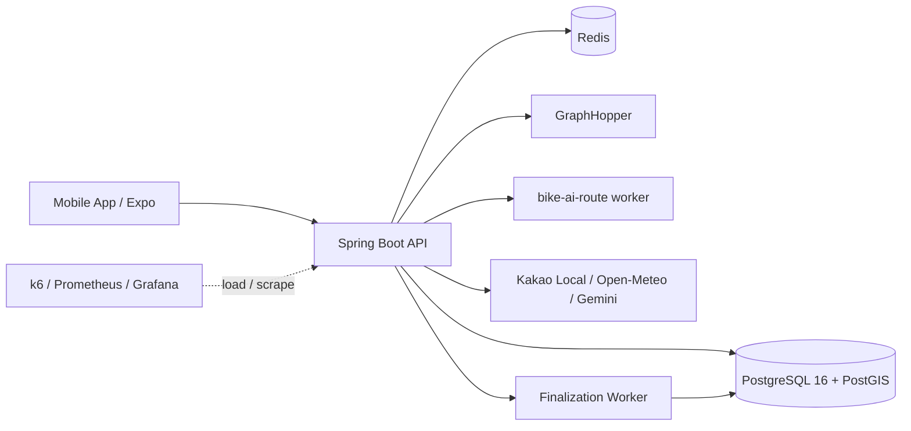

# BIKE Backend


BIKE/GAJA는 자전거 여행 앱을 위한 Spring Boot 백엔드입니다.
자연어 기반 코스 추천, 코스따라가기 HUD, 자유주행 기록 저장, Party 위치 공유를 지원합니다.

이 저장소의 핵심은 단순 CRUD가 아니라, 위치/경로 도메인에서 생기는 운영 리스크를 검증 가능한 방식으로 다룬 점입니다.
"AI가 경로를 만든다"는 표현 뒤에 숨기 쉬운 좌표 정합성, 외부 API 실패, DB connection 고갈, 주행 기록 후처리 지연을 백엔드 설계와 테스트 기준으로 분리했습니다.

## At a Glance

| 사용자 흐름 | 백엔드가 책임지는 것 | 운영 관점 |
|---|---|---|
| AI 코스 추천 | 자연어를 `RoutePreference`로 정규화하고 GraphHopper/GIS evidence로 후보를 평가 | provider 실패와 품질 근거 부족을 fallback metadata로 노출 |
| 코스따라가기 | route polyline projection으로 진행률, 이탈, 잔여거리, 완주 가능성 계산 | read/HUD 부하를 저장/AI 부하와 분리해 p95/p99 측정 |
| 자유주행 저장 | 모바일 GPS trace를 batch 저장하고 finalization worker가 보정 | 저장 폭주 시 `RIDE_SAVE_BUSY`와 비동기 `FINALIZING -> READY` UX로 보호 |
| Party 위치 공유 | socket token과 Party 권한을 기준으로 위치 공유 | Redis token/cache 장애와 다중 인스턴스 한계를 별도 검증 대상으로 분리 |

## Quick Links

- [Architecture](#architecture)
- [Core Features](#core-features)
- [API Groups](#api-groups)
- [Operational Testing Evidence](#operational-testing-evidence)
- [Getting Started](#getting-started)

## Highlights

| 영역 | 구현 포인트 |
|---|---|
| AI 코스 생성 | LLM이 좌표를 찍는 구조가 아니라, 자연어를 `RoutePreference`로 정규화하고 GraphHopper custom weighting/GIS evidence/백엔드 scorer로 후보를 평가합니다. |
| 코스따라가기 HUD | route point 하나와 현재 위치를 단순 비교하지 않고, route polyline projection으로 진행률, 이탈 거리, 잔여 거리, 완주 가능성을 계산합니다. |
| 자유주행 저장 | 모바일에서 모은 GPS trace를 REST batch로 저장하고, finalization worker가 smoothing/후처리를 수행합니다. 저장 직후에는 `FINALIZING`, 완료 후 `READY`로 전환합니다. |
| 운영 보호 | DB connection 고갈, provider timeout, Redis 장애, GraphHopper 지연 같은 상황을 빠른 429/503, fallback metadata, stale cache, retryable response로 분리합니다. |
| 관측성 | request id/trace id, endpoint p95/p99, 내부 operation duration, Hikari metric, Redis metric, provider latency/failure, finalization backlog를 함께 봅니다. |
| 검증 방식 | local smoke에서 AWS short evidence gate까지 단계화하고, 비용이 생기는 검증은 TTL/삭제 기준을 둡니다. |

## Architecture



### Runtime Roles

| Role | 책임 |
|---|---|
| API | 인증, 코스, 주행 기록, 주소검색, 날씨, AI route session, Party API를 처리합니다. |
| Worker | 자유주행 기록 finalization, smoothing, 재처리, job 상태 전이를 담당합니다. |
| Redis | quota/rate-limit, socket token, idempotency lock, weather/route cache를 담당합니다. |
| GraphHopper | 실제 자전거 경로 탐색과 route detail evidence를 제공합니다. |
| AI worker | 자연어 의도 정규화, 후보 설명, trade-off 문구 생성을 담당합니다. |

## Core Features

### 1. AI Route Recommendation

```text
사용자 입력
  -> RoutePreference 정규화
  -> GraphHopper profile/custom weighting 적용
  -> GIS evidence 기반 score 계산
  -> AI worker 설명 생성
  -> 후보 저장/따라가기 연결
```

주요 기준:

- GraphHopper 호출은 기본 1회, 후보 비교 시 최대 3회로 제한합니다.
- 안전/통행 가능성은 hard filter, 평지/자전거도로/강변/노면 선호는 soft weight로 처리합니다.
- scenery, riverside, park 같은 근거가 부족하면 성공처럼 숨기지 않고 `PARTIAL` 또는 `UNKNOWN` metadata로 내려줍니다.
- AI worker가 실패해도 좌표와 route point 정합성은 백엔드/GraphHopper evidence를 기준으로 유지합니다.

### 2. Course Follow HUD

코스따라가기는 단순히 "현재 위치가 route point와 가까운가"를 보지 않습니다.

- route points를 polyline segment로 변환합니다.
- 현재 위치를 가장 가까운 선분에 정사영합니다.
- `nearestSegmentIndex`, `distanceAlongRouteM`, `remainingDistanceM`, `progressPercent`를 계산합니다.
- GPS 튐을 흡수하기 위해 `ON_ROUTE -> CANDIDATE -> WARNING -> ON_ROUTE` 상태 전이를 둡니다.
- 완주는 종점 근접만 보지 않고 coverage 기반으로 판단합니다.

### 3. Ride Record Finalization

자유주행 저장은 사용자 응답 경로와 후처리를 분리합니다.

- 모바일 앱은 GPS trace를 로컬에 보존합니다.
- 서버는 `clientRideId` 기준으로 중복 저장을 막습니다.
- 저장 성공 후 finalization job을 만들고 `FINALIZING` 상태를 반환할 수 있습니다.
- worker가 trace smoothing과 보정 작업을 끝내면 `READY`가 됩니다.
- 저장 요청이 몰리면 오래 버티다 실패하지 않고 `RIDE_SAVE_BUSY`와 `Retry-After`로 빠르게 보호합니다.

### 4. Weather / Address / Provider Fallback

외부 API는 핵심 사용자 흐름을 막지 않도록 기능별로 다르게 처리합니다.

| 기능 | 우선 provider | fallback / 보호 정책 |
|---|---|---|
| 주소검색 | Kakao Local | Nominatim fallback, fallback metadata 제공 |
| 날씨 | Open-Meteo | 구역 단위 Redis cache, stale fallback, cold miss soft-degrade |
| AI 설명 | Gemini / AI worker | backend fallback explanation, provider failure metadata |
| Routing | self-host GraphHopper | fake/hosted fallback 후보를 분리 검증 |

## API Groups

| Group | 대표 API |
|---|---|
| Health/Ops | `GET /health`, `GET /health/monitor` |
| Auth | `POST /api/v1/auth/register`, `POST /api/v1/auth/login`, `POST /api/v1/auth/refresh`, `POST /api/v1/auth/logout`, `GET /api/v1/auth/me` |
| Course | `GET /api/v1/courses`, `GET /api/v1/courses/{id}`, `GET /api/v1/courses/{id}/route-points` |
| Follow | `POST /api/v1/courses/{id}/ride-policy/evaluate` |
| Ride Record | `POST /api/v1/ride-records`, `POST /api/v1/ride-records/{id}/trace`, `POST /api/v1/ride-records/{id}/regenerate`, `DELETE /api/v1/ride-records/{id}` |
| AI Route | `POST /api/v1/ai-routes/plan`, `POST /api/v1/ai-routes/plan/from-text`, AI route session/candidate APIs |
| Address | `GET /api/v1/addresses/search` |
| Weather | `GET /api/v1/weather/current` |
| Party | Party REST APIs, socket token, `WS /ws/v1/parties/{id}/locations` |
| Events | client event single/batch 수집 |

## Tech Stack

| Layer | Stack |
|---|---|
| Language | Java 17 |
| Framework | Spring Boot 3.5.x |
| Build | Gradle |
| Database | PostgreSQL 16, PostGIS, Flyway |
| Cache / Lock | Redis |
| Routing | GraphHopper self-host |
| AI | `bike-ai-route` worker, Gemini provider, backend fallback |
| Testing | JUnit, Spring Boot Test, Python smoke scripts, k6 |
| Observability | Actuator, Prometheus metrics, Grafana, request id / trace id |
| Infra | Docker Compose local, managed dev infra 후보, AWS short evidence gate |

## Operational Testing Evidence

운영 검증은 "몇 명까지 버틴다"보다 **어떤 병목을 어떤 근거로 찾았는가**에 집중했습니다.
아래 수치는 출시 보증이 아니라, AWS 분리형 테스트 환경에서 병목을 찾고 개선 방향을 정한 evidence입니다.

| 검증 | 대표 결과 | Evidence |
|---|---|---|
| 50VU read/HUD/write stress | HTTP 실패율 0%, p95 약 28ms | `ops/loadtest/results/aws-stress-50vu-20260628-0112-summary.json` |
| AI route provider drill | HTTP 실패율 0%, p95 약 249ms | `ops/loadtest/results/aws-ai-route-2vu-20260628-0114-summary.json` |
| AI 포함 50VU 1차 | 실패율 약 4.23%, p95 약 5011ms, Hikari timeout 확인 | `ops/loadtest/results/aws-mixed-ai-50vu-20260628-0115-summary.json` |
| Hikari/app sizing + token pool 보정 후 AI 포함 50VU | HTTP 실패율 0%, endpoint failure 0%, p95 약 39ms, p99 약 108ms | `ops/loadtest/results/aws-mixed-ai-50vu-tokenpool-ready8s-20260628-0412-summary.json` |
| Course follow read/HUD 50VU 분리 검증 | 실패율 0%, p95 약 41ms, p99 약 95ms | `ops/loadtest/results/aws-course-follow-readhud-50vu-20260628-0423-summary.json` |
| Ride finalization 50VU 분리 검증 | READY 실패율 0%, READY wait p95 약 5.8초. 저장 backpressure 리스크는 별도 대응 대상으로 분리 | `ops/loadtest/results/aws-ride-finalization-50vu-20260628-0424-summary.json` |

### 확인한 병목과 대응

- 50VU 혼합 부하에서 GraphHopper보다 DB connection 경쟁이 먼저 병목이 됐습니다.
- Hikari pool만 무작정 키우지 않고, 테스트 모델의 반복 회원가입 write 부하를 token pool로 분리했습니다.
- AI route capacity `429`는 장애가 아니라 provider 보호용 backpressure로 분류했습니다.
- 저장 직후 즉시 코스화는 동기 완료를 강제하지 않고 `FINALIZING -> READY` 비동기 UX로 확정했습니다.
- 주행 저장 요청은 read/HUD를 보호하기 위해 빠른 `RIDE_SAVE_BUSY` 응답과 재시도 UX를 둡니다.

## Getting Started

### Requirements

- JDK 17
- Docker / Docker Compose
- PostgreSQL 16 + PostGIS
- Redis
- GraphHopper local data, or fake routing profile for smoke tests

### Run Locally

```bash
git clone https://github.com/BIKE-PROJECT-MINJI/bike-back.git
cd bike-back

./gradlew --no-daemon clean check
./gradlew bootRun
```

Health check:

```bash
curl -fsS http://127.0.0.1:8080/health
curl -i http://127.0.0.1:8080/health/monitor
```

### Smoke Tests

Hybrid preflight:

```bash
./ops/smoke/run-hybrid-preflight.sh
```

AI route / GraphHopper evidence smoke:

```bash
BIKE_SMOKE_BASE_URL=http://127.0.0.1:8080 \
BIKE_SMOKE_GRAPHHOPPER_URL=http://127.0.0.1:8989 \
./ops/smoke/run-ai-route-evidence-smoke.sh
```

AWS short evidence gate:

```bash
AWS_ROUTING_MODE=fake ./ops/loadtest/run-aws-compose-k6.sh
```

AWS 검증은 비용이 발생하므로 기본 개발 루프로 사용하지 않습니다. 실행 전 테스트 목적, TTL, 삭제 대상, 중단 기준을 먼저 정합니다.

## Project Structure

```text
src/main/java/com/bikeprojectminji/bikeback
  auth/              인증, refresh token rotation
  course/            코스 목록/상세/route points/follow 정책
  ride/              자유주행 기록, trace, finalization
  airoute/           AI route orchestration, fallback, metadata
  address/           Kakao/Nominatim 주소검색
  weather/           Open-Meteo, Redis cache, stale fallback
  party/             Party REST/WebSocket 위치 공유
  common/            공통 응답, 예외, request id/trace id

ops/
  smoke/             로컬/하이브리드/API smoke scripts
  loadtest/          k6 부하테스트와 readable report
  graphhopper/       GraphHopper local config
  observability/     Prometheus/Grafana/CloudWatch sample
```

## Engineering Rules

- 이미 적용된 Flyway migration은 수정하지 않고 새 migration으로 보정합니다.
- API 응답 계약이 바뀌면 controller/DTO, Swagger/OpenAPI, 프론트 상태 모델, smoke를 함께 확인합니다.
- secret, token, provider key, DB/Redis credential은 README, log, k6 summary, evidence에 평문으로 남기지 않습니다.
- 운영 부하테스트는 smoke/contract/integration이 통과한 뒤에만 실행합니다.
- AWS 리소스는 테스트 후 삭제 evidence까지 확인해야 완료로 봅니다.

## Related Repository

- AI route worker: [BIKE-PROJECT-MINJI/bike-ai-route](https://github.com/BIKE-PROJECT-MINJI/bike-ai-route)

## What I Can Explain From This Project

이 저장소에서 포트폴리오나 면접 때 설명할 수 있는 핵심 경험입니다.

- Spring Boot 기반 위치/경로 도메인 API 설계
- GraphHopper custom weighting과 GIS evidence 기반 경로 추천
- route polyline projection 기반 HUD 진행률/이탈/완주 판정
- `clientRideId` 멱등성, Redis lock, DB unique constraint를 이용한 중복 저장 방지
- finalization worker와 비동기 UX 설계
- k6 p95/p99, Hikari, Redis, provider metric 기반 병목 분석
- 외부 provider 장애 시 fallback metadata와 soft-degrade UX 설계
- AWS 분리형 검증 환경에서 병목 분리와 비용 보호 runbook 운영
